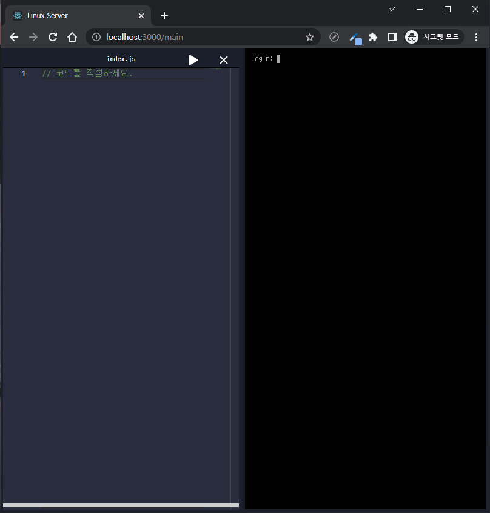
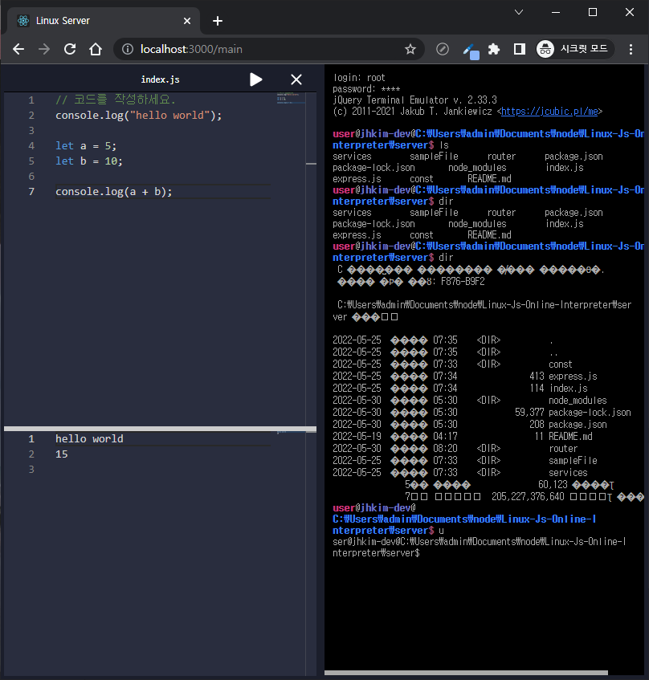

# <div align="center"> Linux-Js-Online-Interpreter </div>

<div align="center">

An interpreter open source project that allows you to connect and run Linux Shell, Nodejs, TypeScript, and JavaScript on a web-based basis

</div>

### Basic specification

> Server: NodeJS, express, jayson with rpc <br>
> Client : React

The project uses a web page to send JavaScript execution code to the server. The execution of the transmitted code is executed by the server and the resulting value is returned.

## Installation

Server:

```sh
cd Server
npm install --save
node index.js
```

Client:

```sh
cd Client
npm install --save
npm start
```

## Preview

### `Step 1. login with Web Page`

<p></p>

> id: root pw : root <br>

<br>

### `Step 2. login with Web Console`

<p></p>

> id: anythings pw : anythings <br>

<br>

### `Step 3. Test using a web console and an editor`

<p></p>

<br>

## HomePage

Github © [Page](https://github.com/A-big-fish-in-a-small-pond/)
 © [Jihee](https://github.com/hollister8)

## License

this is licensed under GNU LGPL Version 3 license.
